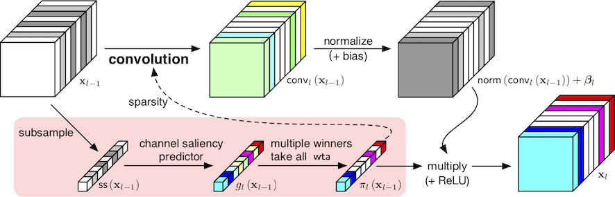

# Feature Boosting and Suppression

## Description

Feature Boosting and Suppression (FBS) is a method
that exploits run-time dynamic information flow in CNNs to
dynamically prune channel-wise parameters.



Intuitively,
we can imagine that
the flow of information of each output channel
can be amplified or restricted
under the control of a “valve”.
This allows salient information
to flow freely
while we stop all information
from unimportant channels
and skip their computation.
Unlike static pruning,
the valves use features
from the previous layer
to predict the saliency of output channels.
FBS introduces tiny auxiliary connections
to existing convolutional layers.
The minimal overhead added
to the existing model is thus negligible
when compared to the potential speed up
provided by the dynamic sparsity.

## To Run

### Running with FBS in Mayo

Please read [`README.md`](../README.md) first.
We provide a set of models
in [`models/gate/`](../models/gate/)
where each one imports
the corresponding base model in [`models/`](../models/).
These can serve as reference YAML files
for you to implement your own models.
The example models used below can be downloaded
from [here](
https://universityofcambridgecloud-my.sharepoint.com/:f:/g/personal/yaz21_cam_ac_uk/Es4FrWNmJe1ImBgR_T1PyoUBB1-D_UCmmeo6KCT_RHDsyQ?e=BzpTzk).
Make sure you place
the downloaded models
in the `checkpoints/{model_name}/{dataset_name}/` directory
before running the following examples.
More models will soon follow.

### Example 1: FBS on MCifarNet + CIFAR-10

As a toy example,
[here](../models/cifarnet.yaml)
is a simple CIFAR-10 classifier
that we wish to prune dynamically.
First, we can estimate the number
of multiply-accumulate operations (MACs)
in a dense pretrained model
using the following command:
```bash
$ ./my \
    models/cifarnet.yaml
    datasets/cifar10.yaml \
    system.checkpoint.load=pretrained \
    eval info
```
This evaluates the pretrained model,
`eval` gives a result of `top1 91.37%, top5: 99.68%`,
and `info` further shows it uses 174M MACs.

```bash
$ ./my \
    models/gate/cifarnet.yaml
    datasets/cifar10.yaml \
    _gate.density=0.5 \
    system.checkpoint.load=gate50 \
    eval info
```
Here is the same model with FBS enabled
with a density of 50%,
it means that at run time
we disable half of the channels
in feature maps.
This model achieves 90.54% top-1
and 99.75% top-5 accuracies using 57M MACs,
giving us a 3x reduction in MACs
and within 1% loss of accuracy.

### Example 2: FBS on slimed VGG16 (Imagenet)

FBS can provide further speed-up
on top of traditional channel-wise pruning,
we demonstrate this
with an FBS-augmented VGG-16 model
that has already been statically pruned
using [Network Slimming](https://arxiv.org/abs/1708.06519).

```bash
$ ./my \
    models/gate/vgg16_compact.yaml \
    datasets/imagenet.yaml \
    _gate.density=0.6 \
    system.checkpoint.load=slimed_gate_60 \
    eval info
```

This model reports 69.59% top-1
and 89.39% top-5 accuracies
using 3.38G MACs.

## Training Your Own Model

We suggest first
fine-tune a pretrained model with 100% density,
and gradually decrease the density
and fine-tune the resulting model
for minimal accuracy drops.
The command is as follows:
```bash
$ ./my \
    models/gate/{model}.yaml \
    datasets/{dataset}.yaml \
    trainers/mobilenet.yaml \
    _gate.density={density} \
    system.checkpoint.load={pretrained_model} \
    train.learning_rate._initial={initial_lr} \ # this adjusts the initial learning rate
    reset-num-epochs train
```

## Changing the Implementation

Please look into [`mayo/net/tf/gate/`](../mayo/net/tf/gate),
especially [`mayo/net/tf/gate/base.py`](../mayo/net/tf/gate/base.py)
and [`mayo/net/tf/gate/parametric.py`](../mayo/net/tf/gate/parametric.py),
if you wish to change its behavior
beyond the supported parameters.

## Citation

```bibtex
@inproceedings{gao2018dynamic,
  title={Dynamic Channel Pruning: Feature Boosting and Suppression},
  author={Xitong Gao and Yiren Zhao and Łukasz Dudziak and Robert Mullins and Cheng-zhong Xu},
  booktitle={International Conference on Learning Representations},
  year={2019},
  url={https://openreview.net/forum?id=BJxh2j0qYm},
}
```
